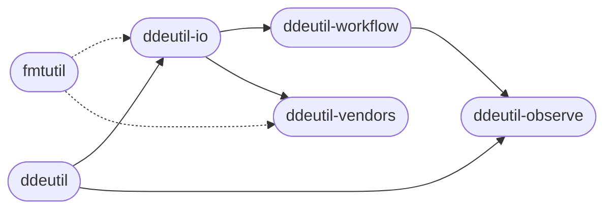

# Welcome to Data Developer and Engineer 👋

For knowledge document of this organization, you can follow this like [Document](http://ddeutils.github.io/ddedocs).

## :pushpin: Components

This organization has the propose to make lightweight data orchestration framework for small to
middle project scale (1-1000 workflows).

Firstly, I will implement base projects, [**Core** (utility functions)](https://github.com/ddeutils/ddeutil)
and [**IO** (Input/Output transport utility objects)](https://github.com/ddeutils/ddeutil-io)
for the first dependency packages because it has a lot of base code to make main package and I do
not want to develop this code on the main package, for example, it do not good if I want fix bug
on the merge key function that no relate with the workflow package

:dart: The main package of this organize orchestration framework has 2 layers and I split it with 2 projects
for optional installation requirement (you can only use just one of these layers without raise error).

- [:runner: **Workflow**](https://github.com/ddeutils/ddeutil-workflow) - Lightweight workflow orchestration in Python with less dependencies.
- [:satellite: **Observe**](https://github.com/ddeutils/ddeutil-observe) - Lightweight observation application with FastAPI for the workflow package.

> [!NOTE]
> I have some 3rd-party projects, [Vendors](https://github.com/ddeutils/ddeutil-vendors), for keeping
> an additional practices to use any 3rd API connect data source, like `polars`, `duckdb`, etc.
> It be dynamic data processing & transformation objects from external vendor packages.

## :cocktail: External

This organize has some mini-projects that develop for specific usecase:

- [ddeapp-flask](https://github.com/ddeutils/ddeapp-flask) - Full-Stack Data Orchestration from Yaml template with Flask & HTMX
- [ddeapp-fastapi](https://github.com/ddeutils/ddeapp-fastapi) - Routing Application Service deploy to On-Premise server with FastAPI

> [!WARNING]
> The above projects have a lot of bugs and need time to fix and refactored the code.
